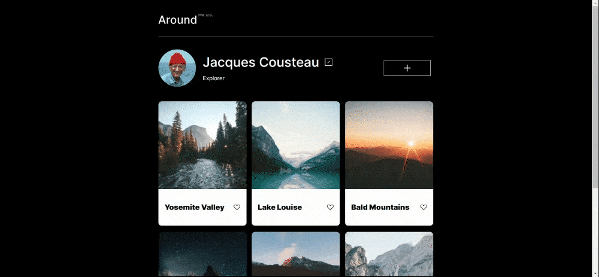
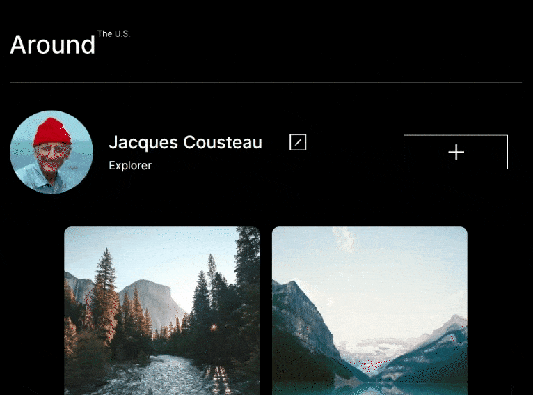
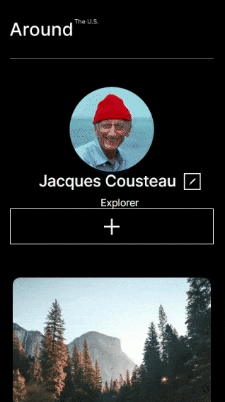

# Project 3: Around The U.S.

### Overview  

The main objective of this project was to design a responsive website that can provide images from around the U.S. to its visitors.

To implement this project, the below web developer tools were used.

- Figma
- HTML
- CSS .

**Figma**  

* [Link to the project on Figma](https://www.figma.com/file/ii4xxsJ0ghevUOcssTlHZv/Sprint-3%3A-Around-the-US?node-id=0%3A1)  

**GitHub Pages**

*[Link to the project on GitHub Pages](https://aonattt.github.io/se_project_aroundtheus/)

**GIFs**  

The gifs below are to show how the website responses to the changing screen sizes.

###### Desktop

###### Tablet

###### Mobile

